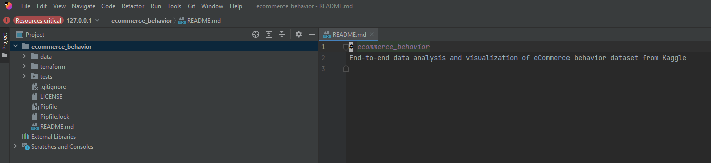
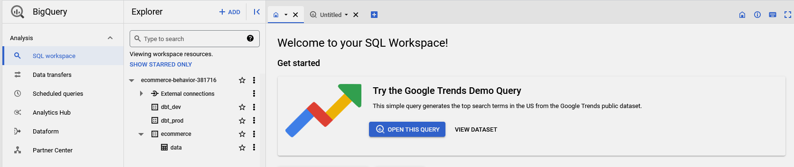

# eCommerce cosmetic shop customer data analysis

# Problem description


Any eCommerce company acquires, transforms and stores lots of data about their customers behavior while they are browsing, purchasing, paying for the products, etc. All information is collected real-time.
To improve such business metrics as customer retention, conversion rate, average purchase and others it is crucial to regularly perform business analysis of collected information, propose improvements and act upon them.

This analysis may involve customer churn prediction, clustering, modeling the effectof new features, identifying patterns in their actions online, calculating predefined metrics and tracking their change in time,…

# Dataset description

This particular dataset comes from Kaggle:

[eCommerce Events History in Cosmetics Shop](https://www.kaggle.com/datasets/mkechinov/ecommerce-events-history-in-cosmetics-shop)

Raw data is split by one month per file and covers 5 months (Oct 2019 – Feb 2020).
Each row in the file represents an event. All events are related to products and users. Each event is like many-to-many relation between products and users.

## File structure

| Property             | Description                                                                                                                                                      |
|----------------------|------------------------------------------------------------------------------------------------------------------------------------------------------------------|    
| event_time           | Time when event happened at (in UTC).                                                                                                                            |    
| event_type           | purchase / cart /  view / remove_from_cart / purchase                                                                                                            |    
| product_id           | ID of a product.                                                                                                                                                 |    
| category_id          | Product's category ID.                                                                                                                                           |    
| category_code        | Product's category taxonomy (code name) if it was possible to make it. Usually present for meaningful categories and skipped for different kinds of accessories. |  
| brand                | Brand name. Can be missing.                                                                                                                                      |    
| price                | Float price of a product.                                                                                                                                        |    
| user_id              | Permanent user ID.                                                                                                                                               |   
| user_session         | Temporary user's session ID. Same for each user's session. Is changed every time user come back to online store from a long pause.                               |  

# Objective

Develop an end-to-end data ingestion, processing and analysis pipeline including a dashboard for users to perform advanced analytics and prediction models. Namely:

- Copy data from the data source (Kaggle) to the data lake (Google Cloud Storage)
- Copy data from the data lake to the data warehouse (BigQuery)
- Transform and **produce interesting data from the staging-data**, and store them in development/production-data *(using DBT)*
- Create a **custom dashboard to display some of the information** stored in the production-data.

# Technologies

- Terraform:  to pre-configure GCP
- Google Cloud Platform:
    - Google Cloud Storage for the Data-lake
    - Big Query for the Data-warehouse.
    - Google Compute Engine (Virtual Machine)
- Python
- Prefect for orchestrating data ingestion to the Data Lake and Data Warehouse
- Data Build Tool (dbt) ****to transform data and create new high-level tables
- Google Looker Studio: create and host dashboards and reports.


# How to reproduce the project

Prerequisites:

- [www.gmail.com](http://www.gmail.com) account
- [www.kaggle.com](http://www.kaggle.com) account
- [www.](http://www.dbt.com)getdbt.com account

## Set up Google Cloud Platform (GCP) project

### Create a new project: *ecommerce-behavior*

<aside>
💡 Note down that the project ID will be different for you, as it should be unique across all users. Note it down as it will be used as an input to many pipeline steps.

</aside>

[https://console.cloud.google.com/projectcreate](https://console.cloud.google.com/projectcreate)


### Create a service account


Necessary access rights: *storage admin, bigquery, storage object admin*


Create an API key for the service account. 


Save generated key as json file: `ecommerce-behavior-381716-8015d2562308.json` 
Put generated file somewhere, but make sure not to commit it accidentally to your repo (add to .gitignore). Later we will copy these credentials to the VM.


### Create a Compute Instance \ Virtual Machine (VM)

Go to Compute Engine API and enable it if not active yet.


Create a new VM. I called the VM `vm-ecommerce-behavior`.
Choose suitable compute resources (≥8 Gb RAM), region\zone.


Setup the boot disk: 

<aside>
💡 Operating system: Ubuntu
Version: Ubuntu 20.04 LTS
Boot disk type: Standard persistent disk
Size: 40GB

</aside>


## Setup remote access to your VM

### Generate an SSH key pair

[https://cloud.google.com/compute/docs/connect/create-ssh-keys](https://cloud.google.com/compute/docs/connect/create-ssh-keys)

In the terminal run:
`ssh-keygen -t rsa -f KEYFILE_NAME -C USER_NAME -b 2048`

`ssh-keygen -t rsa -f gcp -C fn -b 2048`

This will create a public (gcp.pub) and private (gcp) key-files in your *~/.ssh* directory


### Add the **public** key to the Compute Engine metadata


### Get the VM external IP

Go to the VM, check the check box and press start if it's not already running.
Copy the External IP address that is displayed once it starts: 34.141.225.195


### Update/create a config file in your local ~/.ssh directory

 You can then create a config file in your .ssh directory and add the following entry:

```bash
Host <name to use when connecting
    HostName <public IP address>
    User <User name you chose when running the ssh-keygen command>
    IdentityFile /home/<local user name>/.ssh/<your private key>
```

```bash
Host ecommerce
    HostName 34.141.225.195
    User fn
    IdentityFile C:\Users\320188473\.ssh\gcp-ecommerce
```

### Remote login to VM

Now you can run `ssh ecommerce` in your terminal to connect to the VM.

## Port forwarding and remote development instructions

### Option 1: (the easiest, advised): use Visual Studio Code

VS code has built-in functionality to do port forwarding and code in the remote environment via SSH

[https://code.visualstudio.com/docs/remote/ssh](https://code.visualstudio.com/docs/remote/ssh)

### Option 2: terminal

Open and run the following ssh commands in separate powershell windows (one per port)

`ssh -i ~/.ssh/PRIVATE_SSH_KEY -L PORT_LOCAL:localhost:PORT_REMOTE USER_NAME@EXTERNAL_IP`

`ssh -i ~/.ssh/gcp-ecommerce -N -L 4200:localhost:4200 fn@34.141.225.195`

This method is not persistent, exists only while cmd is open. To make it persistent either use some ssh flag, and then ****kill**** the ssh process every time to reset port forwarding. Or go for another option.

### Option 3: PuTTY

First need to convert SSH keys to the PuTTy format

Puttygen > Import Key > select private key >saveprivate key > name : *_ppk.ppk


### Remote development with PyCharm




## Setup the VM environment

### Clone git repository

`git clone [https://github.com/fluentnumbers/ecommerce_behavior.git](https://github.com/fluentnumbers/ecommerce_behavior.git)`

### Move credential files to the VM

- Kaggle credentials for the dataset access

Go to your kaggle account settings and download a token as *kaggle.json*


**locally** `cd` to the folder with *kaggle.json* 

`sftp ecommerce` (or your hostname in .ssh/config)

`put kaggle.json ecommerce_behavior/credentials/kaggle.json` transfer the files

`chmod 600 /home/fn/ecommerce_behavior/credentials/kaggle.json` (mind that *fn* is the username)

- GCP credentials

**locally** `cd` to where you stored your GCP service account credentials file `ecommerce-behavior-381716-8015d2562308.json`.

`sftp ecommerce` (or your hostname in .ssh/config)

`put ecommerce-behavior-381716-8015d2562308.json ecommerce_behavior/credentials/ecommerce-behavior-381716-8015d2562308`to transfer the files to the `.gc` directory.

`exit` and `ssh ecommerce` again

### Other steps

`sudo apt-get update`

`sudo apt-get install make -y`

`sudo apt-get install wget`

### Install Anaconda

`wget https://repo.anaconda.com/archive/Anaconda3-2022.10-Linux-x86_64.sh`

`bash Anaconda3-2022.10-Linux-x86_64.sh`

`source .bashrc` or log out \ log in to the VM. 

### Configuration

Go to the *ecommerce_behavior\.env_sample*, copy and rename it to *.env* (git ignored) **and check the file for necessary changes, but at the very least you need to adjust:

```bash
# CHANGE_THIS
GCP_PROJECT_ID=ecommerce-behavior-381716
# CHANGE_THIS
GCP_CREDENTIALS_PATH=/home/fn/ecommerce_behavior/credentials/ecommerce-behavior-381716-8015d2562308.json
# CHANGE_THIS
GCP_BUCKETNAME=ecommerce_ecommerce-behavior-381716
# CHANGE_THIS
GCP_REGION=europe-west4
```

After all is set:

`cd ecommerce_behavior`

`pip install -r requirements.txt`

`make vm_setup` installs terraform, sets environmental variables and GCP auth

## GCP infrastructure setup with Terraform

`cd ecommerce_behavior`

`make terraform_setup` init, plan and apply IaC

You should see lots of outputs


`gcloud auth application-default login` and follow instructions to authorize


## Prefect deployments setup

`cd ecommerce_behavior`

`make prefect_start_ui`

You can now access Prefect UI in your [http://localhost:4200/](http://localhost:4200/) (if the port 4200 is forwarded properly)

**Switch to another terminal window**

`make prefect_create_blocks` blocks are created: [http://localhost:4200/blocks](http://localhost:4200/blocks)

`make prefect_build_deployment`

`make prefect_agent_start`

**Switch to another terminal window**

`make prefect_run_web2gcp`

Raw data converted to .parquet should appear in the GCP bucket:


**Wait until it is finished copying files to GCP.**

`make prefect_run_gcp2bq`

Same data joined into one table should appear in your BigQuery:


## Transform data with DBT cloud

## Create development environment

Create a project **ecommerce** with Project subdirectory **dbt:**


Select BigQuery as a Database Connection:


Upload GCP service account `ecommerce-behavior-381716-8015d2562308.json` file:


Define the name for the BigQuery dataset where the development results will appear: **dbt_dev**  ****(or whatever is set in our .*env* file)


When later DBT models are run in development environment, this dataset will be created (if not existing already). Though, it will be created with default Region and other settings, so it is recommended to pre-create a **dbt_dev** dataset in BQ in the same location as the original dataset with data (europe-west4). If `make terraform_setup` step was done correctly, then the dataset already exists.



Select git clone and paste the SSH key `git@github.com:fluentnumbers/ecommerce_behavior.git` from the repo.


You will get to see a deploy key, copy it and head to your Github repo >> settings tab>>Security>>Deploy keys. Add the copied key and check the mark “Allow write access”:


Go to DBT, change branch to *dbtdev*  and start developing additinal models if needed. 
Current models are quite simplistic as the focus was not on the data analytics, but on the DE part. There is table partitioning step by month and clustering by user-id. It seems that total queries execution time improves, but can be that not all queries benefit from partitioning. 

 


## Create production environment

We configured the development environment such that commands like `dbt build` and `dbt run` will create new entities inside the **dbt_dev** dataset inside the BQ. Once the development is done we would like to execute (scheduled) jobs only for the queries relevant for the end user, that is in Production environment. 

Therefore we create a Deployment environment in *Deploy>>Environments* and the outputs will be stored into the **dbt_prod** (or whatever is set in our .*env* file) ****dataset. Same as for the development it is better to pre-create the dataset in BQ. If `make terraform_setup` step was done correctly, then the dataset already exists.

By default deployment runs are executed for the main branch, so make sure to merge necessary changes from the development.


Also create a deployment job in *Deploy>>Jobs>Create Job*:
Select Production environment, *dbt build* as a command, press *Save.*

## Create a deployment job

*Deploy>>Jobs>>Create job*


One can now trigger the job manually, using predefined schedule, etc.

## Transform data

Go to *Deploy>>Jobs* and run “Production run”. Once the job is finished successfully you should see new tables in your BigQuery **dbt_prod** dataset.


## Dashboard

Go to [https://lookerstudio.google.com/](https://lookerstudio.google.com/), authorize BigQuery usage and compose a dashboard from available tables.
Mine draft dashboard is available here: https://lookerstudio.google.com/reporting/8b14d1fc-321b-4987-93f7-66d895a4394c


# Future work

- Perform more meaningful analysis of the data with multiple inter-dependent DBT models (this project work was focused on DE practices and tools)
- Automate project and VM creation (can be done from a local machine using Google CLI, before establishing remote connection)
- Dockerize all steps (docker-compose up it using makefile)
- Explore the potential of Prefect + DBT binding
- Dashboard in Dash + hosting on Heroku\Fly.ai with more advanced graphs (following more advanced analysis)
